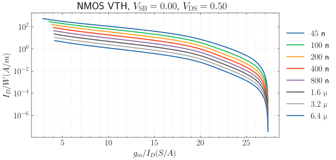
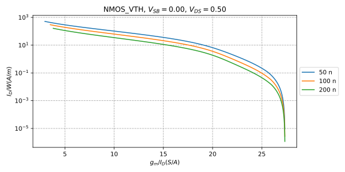
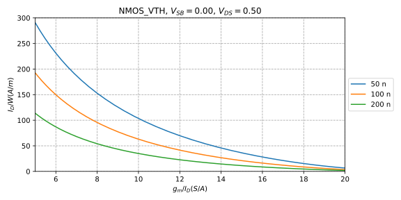
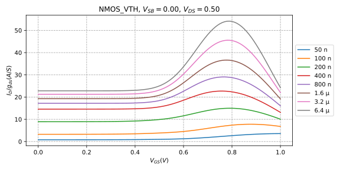
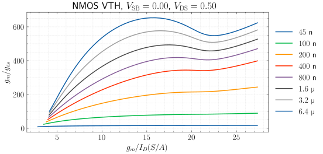
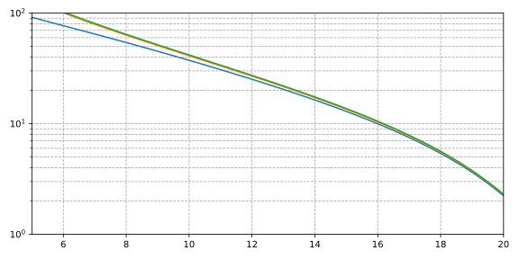
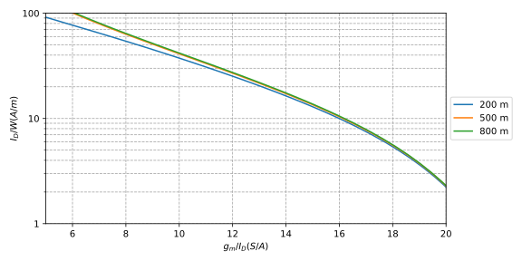
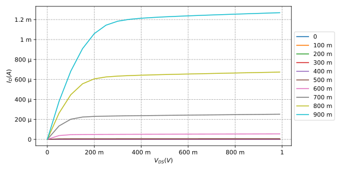

# MOSFET Characterization in Python

## Motivation

This tool has the following goals:

1. Provide an easy way of creating plots of MOSFET parameters, such as those
   used in the gm/ID design methodology.

2. Provide a tool that does not depend on any proprietary software or require
   licensing fees.

3. Open source so that it can be easily modified/extended by the user.

## Installation

### Requirements

This tools is written in Python and requires the following packages:

- [`PySpice`](https://pypi.org/project/PySpice/) for providing an interface
  between Python and the open-source [`ngspice`](https://ngspice.sourceforge.io/)
  simulator.
- `Numpy`, `Scipy`, and `Matplotlib` for data analysis and plotting.

Note that installing `PySpice` installs `Numpy`, `Scipy`, and `Matplotlib`. So, it is
only necessary to install `PySpice`.

### Conda

`PySpice` can be installed the conventional way with `pip`. However, if you
already use `conda` environments, the required steps are listed below.

```sh
conda create -n pyspice
conda activate pyspice
conda install -c conda-forge pyspice
conda install -c conda-forge ngspice ngspice-lib
conda install ipykernel
ipython kernel install --user --name=pyspice
```

## Generating a Lookup Table

Before any plots can be made, a lookup table of all the relevant parameters
must first be created. This is done by instantiating an object from the
`LookupTableGenerator` and then building the table with the `build` method. An
example is given below.

```python
obj = LookupTableGenerator (
    vgs = (0, 1, 0.01),
    vds = (0, 1, 0.05),
    vsb = (0, 1, 0.1),
    width = 10e-6,
    lengths = [50e-9, 100e-9, 200e-9, 400e-9, 800e-9, 1.6e-6, 3.2e-6, 6.4e-6],
    models_path = "./models",
    model_names = {
        "nmos": "NMOS_VTH",
        "pmos": "PMOS_VTH"},
    description="freepdk 45nm"
    )
obj.build("./freepdk45_lookup_table.npy")
```

- `vgs`, `vds`, and `vsb` are tuples of the form `(start, stop, step)` and
  define the range of voltages across the gate, drain, and source terminals of
  the MOSFET, respectively.
- The `length` can be provided as a list of discrete values. A 1-dimensional
  `numpy` array is also accepted.
- Only a single `width` should be provided. The assumption here is that the
  parameters of the MOSFET scale linearly with the width. Because of this
  assumption, all parameters that are width-dependent must be de-normalized
  with respect to the current or width that you're working with.
- The directory of where the model files are stored is specified via
  `model_path`. The model names are provided in a dictionary format, as shown
  above. Note that `PySpice` requires the file containing the models to have
  the same name as one of the models used. This is only a slight inconvenience.

## Using the Tool

Because of the interactive nature of designing analog circuits, using this
script within a `jupyter` notebook is highly recommended.

### Imports

We begin by making the following imports:

```python
import numpy as np
from gmid import load_lookup_table, GMID
```

The `load_lookup_table` function loads a lookup table such as the one generated
in the previous section.

```python
lookup_table = load_lookup_table("./freepdk45_lookup_table.npy")
```

The `GMID` class contains methods that can be used to generate plots
seamlessly.

### Making Simple Plots

We start by creating an object called `nmos` that selects the nmos
from the lookup table and sets the source-bulk and drain-source voltages to
some fixed values. Since the data is 4-dimensional, it is necessary to fix two
of the variables at a time to enable 2-dimensional plotting.

```python
nmos = GMID(lookup_table, mos="nmos", vsb=0.0, vds=0.5)
```

Methods are available for the most commonly-used plots in the gm/ID
methodology.

- `current_density_plot()`: this plots $I_{D}/W$ vs $g_{m}/I_{D}$.
- `gain_plot()`: this plots $g_m / g_{ds}$ vs $g_{m}/I_{D}$.
- `transit_frequency_plot()`: this plots $f_{T}$ vs $g_{m}/I_{D}$.
- `early_voltage_plot()`: this plots $V_{A}$, vs $g_{m}/I_{D}$.


For example, the plot of $I_{D}/W$ vs $g_{m}/I_{D}$ is shown below.

```python
nmos.current_density_plot()
```



When the lookup table includes a lot of lengths, the plot can become crowded.
You can pass a list of lengths to plot with the `length` parameter.

Use `nmos.lengths` to get a list of all the lengths in the lookup table.

```
array([5.0e-08, 1.0e-07, 2.0e-07, 4.0e-07, 8.0e-07, 1.6e-06, 3.2e-06,
       6.4e-06])
```

Pass a filtered list to the `current_density_plot` method.

```python
nmos.current_density_plot(
    lengths = [5.0e-08, 1.0e-07, 2.0e-07]
)
```



Note that the tool does its best to determine how to scale the axes. For
example, in the last plot, a `log` scale was chosen for the y-axis. We can
easily overwrite that, as well as other things.

```python
nmos.current_density_plot(
    lengths = [5.0e-08, 1.0e-07, 2.0e-07],
    y_scale = 'linear',
    x_limit = (5, 20),
    y_limit = (0, 300),
)
```



### Plotting by Expression

Now, suppose we want to plot something completely custom. The example below
shows how.

```python
nmos.plot_by_expression(
    x_axis = nmos.vgs_expression,
    y_axis = {
        "variables": ["id", "gds"],
        "function": lambda x, y: x / y,
        "label": "$I_D / g_{ds} (A/S)$"
        },
)
```



For this example, we want $V_{GS}$ on the x-axis. Since $V_{GS}$ is such a
commonly-used expression, it is already defined in the code. Other
commonly-used expressions are also defined.

- `gmid_expression`
- `vgs_expression`
- `vds_expression`
- `vsb_expression`
- `gain_expression`
- `current_density_expression`
- `transist_frequency_expression`
- `early_voltage_expression`

For the y-axis, we want a custom expression that uses the parameters $I_D$ and
$g_{ds}$. This can be done by defining a dictionary that specifies the
variables needed and how to calculate the required parameter. The `label` field
is optional. The function field is also optional if we want to just plot the
parameter.

### Getting Raw Values

While having plots is a good way to visualize trends, we might also just be
interested in the raw value.



Looking at the figure above, it's hard to read exactly the value on the y-axis
for a particular value on the x-axis, especially more so when the scale is
logarithmic.

The snippet below sets the `gmid` to a particular value, sweeps the length over
a range, and calculates the gain. Even though the table does not include all of
the lengths in the sweep variable, their values are interpolated using the
available data. The accuracy of the result depends on how far the points are
from those defined in the table.

Note that for the `expression` argument we could have also used the pre-defined
`gain_expression` to avoid having to define one ourselves.

```python
nmos.lookup_by_gmid(
    length=(180e-9, 1000e-9, 100e-9),
    gmid=15,
    expression={
        "variables": ["gm", "gds"],
        "function": lambda x, y: x / y
    })
```

```
array([171.89462638, 244.7708084 , 303.40565751, 331.66760623,
       351.82406495, 370.72068061, 390.86449014, 403.27318566,
       413.74810267])
```

The retuned data can then used, for example, to make a plot of intrinsic gain
vs. length.


We can also return a single value.

```python
nmos.lookup_by_gmid(
    length=450e-9,
    gmid=15,
    expression=nmos.gain_expression
)
```

### Lookup Methods

In the preceding sections, only one source was allowed to vary while the other
two were fixed. This is fine for simple plots.

Suppose we want to see the dependence of $I_{D}/W$ on $g_m / I_{D}$ for
different values of $V_{DS}$. This is only possible by varying two sources at a
time. Plots of this nature require the use of the entire lookup table. This can
be done using the `lookup` method, as shown in the snippet below.

```python
x = nmos.lookup(
    length = 180e-9,
    vsb = 0,
    vds = (0.2, 1, 0.3),
    vgs = (0.1, 1, 0.01),
    expression = nmos.gmid_expression,
    primary = "vgs"
)

y = nmos.lookup(
    length = 180e-9,
    vsb = 0,
    vds = (0.2, 1, 0.3),
    vgs = (0.1, 1, 0.01),
    expression = nmos.current_density_expression,
    primary = "vgs"
)

nmos.quick_plot(
    x.T,
    y.T,
    x_limit=(5 ,20),
    y_limit=(1, 100)
)
```




If the above code seems a bit too much, there's a wrapper method just for that
with added benefits.

```python
x = nmos.plot_by_sweep(
    length=180e-9,
    vsb = 0,
    vds = (0.2, 1, 0.3),
    vgs = (0.1, 1, 0.01),
    x_axis_expression = nmos.gmid_expression,
    y_axis_expression = nmos.current_density_expression,
    primary = "vgs",
    x_eng_format=True,
    y_eng_format=True,
    y_scale='log',
    x_limit=(5, 20),
    y_limit=(1, 100),
)
```



The `plot_by_sweep` method is extremely flexible and can be used to create all
sorts of plots. For example, the snippet below shows how to plot the
traditional output characteristic plot of a MOSFET.

```python
nmos.plot_by_sweep(
    length=180e-9,
    vsb = 0,
    vds = (0.0, 1, 0.01),
    vgs = (0.0, 1, 0.2),
    x_axis_expression = "vds",
    y_axis_expression = "id",
    primary = "vds",
    x_eng_format=True,
    y_eng_format=True,
    y_scale='linear',
    x_label = "$V_{DS} (V)$",
    y_label = "$I_D (A)$"
)
```


