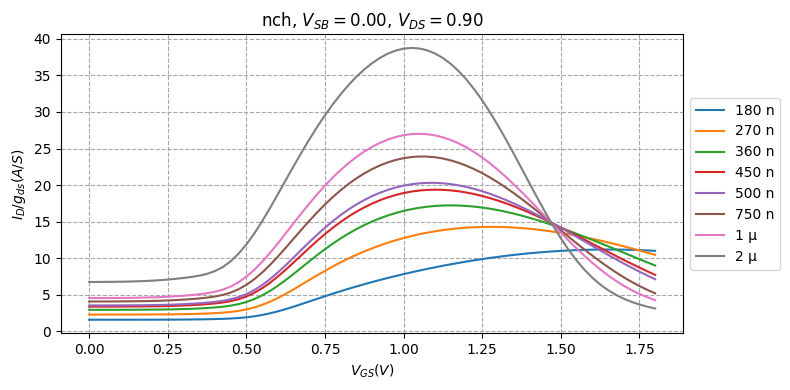
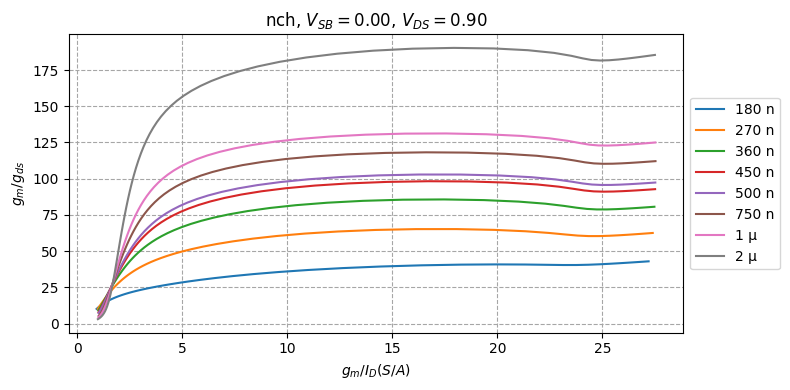
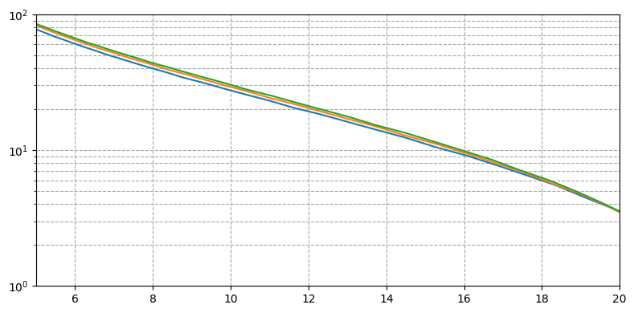
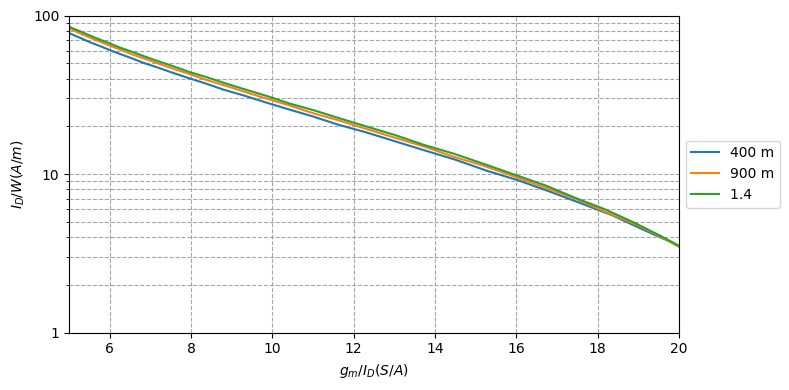
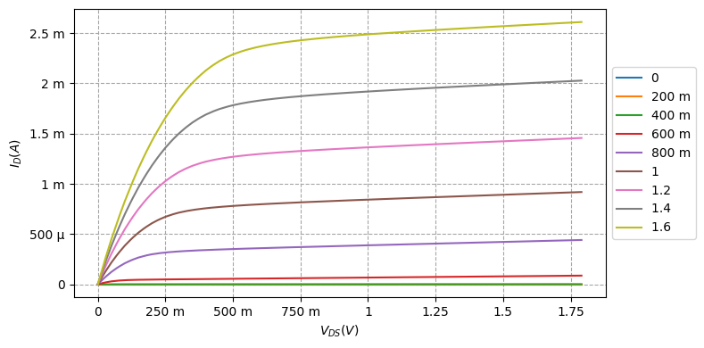

# gmid
Python script for generating lookup tables for the gm/ID design methodology and much more ...

```python
import numpy as np
import matplotlib.pyplot as plt
```

```python
from gmid import GMID, load_lookup_table
```

```python
lookup_table = load_lookup_table("./180n_loopup_table.npy")
```

```python
nmos = GMID(lookup_table, mos="nmos", vsb=0.0, vds=0.9)
```

```python
nmos.current_density_plot()
```


```python
nmos.plot_by_expression(
    x_axis = nmos.vgs_expression,
    y_axis = {"variables": ["id", "gds"], "function": lambda x, y: x / y, "label": "$I_D / g_{ds} (A/S)$"},
)
```



```python
nmos.gain_plot()
```



```python
nmos.lookup_by_gmid(
    length=(180e-9, 1000e-9, 100e-9),
    gmid=15,
    expression={
        "variables": ["gm", "gds"],
        "function": lambda x, y: x / y
    })
```

    array([ 39.62450996,  67.10454173,  88.00738641, 100.66411352,
           107.17273426, 113.65462627, 119.36601913, 124.71826878,
           129.83906668])


```python
x = nmos.lookup(
    length=180e-9,
    vsb = 0,
    vds = (0.4, 1.9, 0.5),
    vgs = (0.1, 1.8, 0.01),
    expression=nmos.gmid_expression,
    primary = "vgs"
)
```

```python
y = nmos.lookup(
    length=180e-9,
    vsb = 0,
    vds = (0.4, 1.9, 0.5),
    vgs = (0.1, 1.8, 0.01),
    expression=nmos.current_density_expression,
    primary = "vgs"
)
```

```python
nmos.quick_plot(
    x.T,
    y.T,
    x_limit=(5 ,20),
    y_limit=(1, 100)
)
```




```python
x = nmos.plot_by_sweep(
    length=180e-9,
    vsb = 0,
    vds = (0.4, 1.9, 0.5),
    vgs = (0.1, 1.8, 0.01),
    x_axis_expression = nmos.gmid_expression,
    y_axis_expression = nmos.current_density_expression,
    primary = "vgs",
    x_eng_format=True,
    y_eng_format=True,
    y_scale='log',
    #x_label = "$g_m$"
    x_limit=(5, 20),
    y_limit=(1, 100),
    #return_result=True
)
```




```python
nmos.plot_by_sweep(
    length=180e-9,
    vsb = 0,
    vds = (0.0, 1.8, 0.01),
    vgs = (0.0, 1.8, 0.2),
    x_axis_expression = "vds",
    y_axis_expression = "id",
    primary = "vds",
    x_eng_format=True,
    y_eng_format=True,
    y_scale='linear',
    x_label = "$V_{DS} (V)$",
    y_label = "$I_D (A)$"
    #return_result=True
)
```


