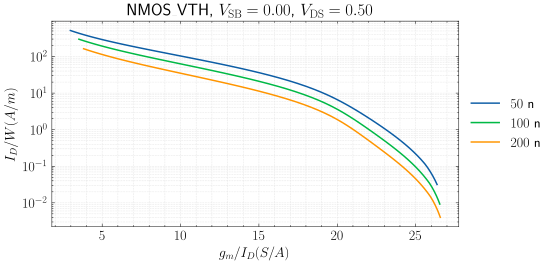
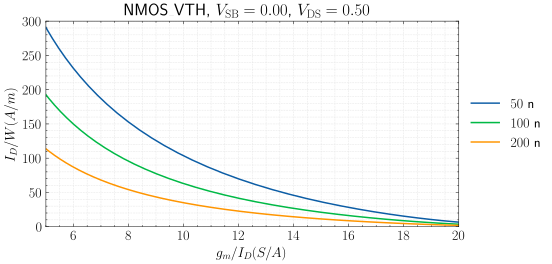
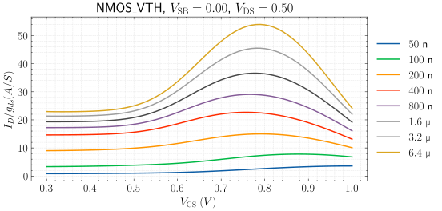
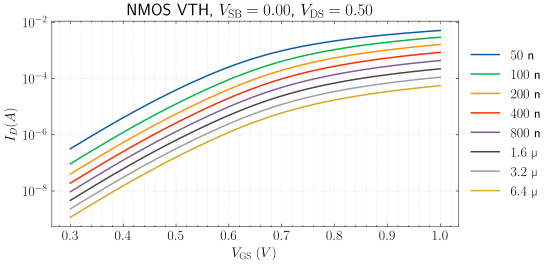
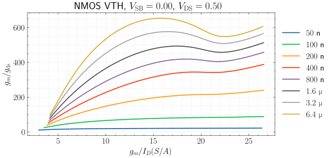

# MOSFET Characterization in Python

## Introduction

This is is simple tool for:

1. Generating lookup tables of mosfet parameters.
2. Making plots of mosfet parameters.

## Installation

### Requirements

This tools is written in Python and requires the following:

- `Numpy`, `Scipy`, and `Matplotlib` for data analysis and plotting.

-  [`ngspice`](https://ngspice.sourceforge.io/) or `hspice` for generating the lookup table.

### Installation

- Clone this repository: `git clone https://github.com/medwatt/gmid.git`.

- Inside the directory, invoke: `pip install .`.

## Generating a Lookup Table

Before any plots can be made, a lookup table of all the relevant parameters
must first be created. This is done by instantiating an object from the
`LookupTableGenerator` and then building the table with the `build` method.
An example is given below.

```python
from mosplot.lookup_table_generator import LookupTableGenerator

obj = LookupTableGenerator(
    description="freepdk 45nm",

    # Simulator to use
    simulator="ngspice", # "ngspice" or "hspice"

    # Provide path to simulator if simulator is not in system path
    simulator_path="/usr/bin/ngspice",

    # Files that should be included with `.INCLUDE`
    include_paths=[
        "/home/username/gmid/models/NMOS_VTH.lib",
        "/home/username/gmid/models/PMOS_VTH.lib",
        ],

    # Files that should be included with `.LIB filename libname`
    # lib_path_names=[
    #     ("filename", "libname"),
    #     ...
    # ]

    # Raw spice to be added if necessary
    # raw_spice = ["line1", "line2", "..."]

    # Names of models to be simulated, specifying the type ("nmos" or "pmos")
    model_names={
        "NMOS_VTH": "nmos",
        "PMOS_VTH": "pmos",
    },

    # Symbols to use for detecting the transistor:
    # ("mosfet/subcircuit name", "hierarchical_name_of_transistor")
    mos_spice_symbols = ("m1", "m1")

    # Fixed width to use in all simulations
    width=10e-6,

    # Voltage sweep parameters
    vsb=(0, 1.0, 0.1),
    vgs=(0, 1.0, 0.01),
    vds=(0, 1.0, 0.01),

    # Length sweep parameters
    lengths=[50e-9, 100e-9, 200e-9, 400e-9, 800e-9, 1.6e-6, 3.2e-6, 6.4e-6],
)

# Run an op simulation if needed to see the outputs returned by the model
# and see the name of hierarchical name of transistor in case the transistor
# is nested in a subcircuit
# obj.op_simulation()

# Build and store the table
obj.build("./freepdk_45nm")

```

## Using the Tool

Because of the interactive nature of designing analog circuits, using this
script within a `jupyter` notebook is highly recommended.

### Imports

We begin by making the following imports:

```python
import numpy as np
from mosplot.plot import load_lookup_table, Mosfet
```

The `load_lookup_table` function loads a lookup table such as the one
generated in the previous section.

```python
lookup_table = load_lookup_table("path/to/lookup-table.npy")
```

The `Mosfet` class contains methods that can be used to generate plots
seamlessly. If you plan to modify the style of the plots or plot things
differently, you will also have to import `matplotlib`.

```python
import matplotlib.pyplot as plt
plt.style.use('path/to/style')
```

### Making Simple Plots

We start by creating an object called `nmos` that selects the `NMOS_VTH`
model from the lookup table and sets the source-bulk and drain-source voltages
to some fixed values. Since the data is 4-dimensional, it is necessary to fix
two of the variables at a time to enable 2-dimensional plotting.

```python
nmos = Mosfet(lookup_table=lookup_table, mos="NMOS_VTH", vsb=0.0, vds=0.5, vgs=(0.3, 1))
```

The above code filters the table at `vsb=0.0` and `vds=0.5` for all
`lengths` and for `vgs` values between `(0.3, 1)`. You can also include a
step such as `(0.3, 1, 0.02)`. If you want all values of `vgs`, either set
it to `None` or don't include it.

Methods are available to create the most commonly-used plots in the gm/ID
methodology so that you don't have to type them. These are:

- `current_density_plot()`: this plots $I_{D}/W$ vs $g_{m}/I_{D}$.
- `gain_plot()`: this plots $g_m / g_{ds}$ vs $g_{m}/I_{D}$.
- `transit_frequency_plot()`: this plots $f_{T}$ vs $g_{m}/I_{D}$.
- `early_voltage_plot()`: this plots $V_{A}$, vs $g_{m}/I_{D}$.

For example, the plot of $I_{D}/W$ vs $g_{m}/I_{D}$ is shown below.

```python
nmos.current_density_plot()
```


When the lookup table includes a lot of lengths, the plot can become crowded.
You can pass a list of lengths to plot with the `length` parameter.

Use `nmos.lengths` to get a list of all the lengths in the lookup table.

```
array([5.0e-08, 1.0e-07, 2.0e-07, 4.0e-07, 8.0e-07, 1.6e-06, 3.2e-06,
       6.4e-06])
```

Pass a filtered list to the `current_density_plot` method.

```python
nmos.current_density_plot(
    lengths = [5.0e-08, 1.0e-07, 2.0e-07]
)
```



Note that the tool does its best to determine how to scale the axes. For
example, in the last plot, a `log` scale was chosen for the y-axis. We can
easily overwrite that, as well as other things.

```python
nmos.current_density_plot(
    lengths = [5.0e-08, 1.0e-07, 2.0e-07],
    y_scale = 'linear',
    x_limit = (5, 20),
    y_limit = (0, 300),
    save_fig="path/to/save/figure/with/extension"
)
```



### Plotting by Expression

Now, suppose we want to plot something completely custom. The example below
shows how.

```python
nmos.plot_by_expression(
    x_expression = nmos.vgs_expression,
    y_expression = {
        "variables": ["id", "gds"],
        "function": lambda x, y: x / y,
        "label": "$I_D / g_{ds} (A/S)$"
        },
)
```



For this example, we want $V_{\mathrm{GS}}$ on the x-axis. Since $V_{\mathrm{GS}}$ is such a
commonly-used expression, it is already defined in the code. Other
commonly-used expressions are also defined, such as:

- `gmid_expression`
- `vgs_expression`
- `vds_expression`
- `vsb_expression`
- `gain_expression`
- `current_density_expression`
- `transist_frequency_expression`
- `early_voltage_expression`

For the y-axis, we want a custom expression that uses the parameters $I_D$ and
$g_{\mathrm{ds}}$. This can be done by defining a dictionary that specifies the
variables needed and how to calculate the required parameter. The `label` field
is optional. The function field is also optional if we want to just plot the
parameter, as shown in the example below.

```python
nmos.plot_by_expression(
    x_expression = nmos.vgs_expression,
    # y_expression = nmos.id_expression, ## same as below
    y_expression = {
        "variables": ["id"],
        "label": "$I_D (A)$"
        }
)
```



## Looking Up Values

While having plots is a good way to visualize trends, we might also just be
interested in the raw value.



Looking at the figure above, it's hard to read the exact value on the y-axis
for a particular value on the x-axis, especially more so when the scale is
logarithmic. Also, what if we need to read the value for a length that
is not defined in our lookup table?

There are two ways to go about this:

- Zoom in and click on the plot. This prints out the `x` and `y`
  coordinates. Note, in jupyter notebooks, you need to execute `%matplotlib
  widget` or `%matplotlib qt` to interact with the plot.

- Use a lookup method to get a more precise value.

### Lookup Using Interpolation

The snippet below shows how we can lookup the `gain` given the `length` and
`gmid`. The returned value is calculated using interpolation from the available
data. The accuracy of the result depends on how far the points are from those
defined in the table.

```python
x = nmos.interpolate(
    x_expression=nmos.lengths_expression,
    x_value=100e-9,
    y_expression=nmos.gmid_expression,
    y_value=15,
    z_expression=nmos.gain_expression,
)
```

The above code evaluates the `gain` at a single point. Suppose we want to know
the `gmid` or `length` for which `0.08 <= vdsat < 0.12` and `1e6 <= gds < 4e-6`.
The snippet below shows how.

```python
x = nmos.interpolate(
    x_expression=nmos.vdsat_expression,
    x_value=(0.08, 0.12, 0.01),
    y_expression=nmos.gds_expression,
    y_value=(1e-6, 4e-6, 1e-6),
    z_expression=nmos.gmid_expression,
    # z_expression=nmos.length_expression,
)
       # 1e-6
array([[17.95041245, 17.89435802, 17.47526426], # 0.08
       [16.87609489, 16.76595338, 16.53927928],
       [14.77585736, 15.09803158, 14.9483348 ],
       [14.12540234, 14.05481451, 14.04265227]])
```

### Lookup By Expression

`lookup_expression_from_table()` simply looks up an expression from the
table. It doesn't use any interpolation. So, make sure that the values you
are looking up are present in the table.

```python
x = nmos.lookup_expression_from_table(
    lengths=100e-9,
    vsb=0,
    vds=(0.0, 1, 0.01),
    vgs=(0.0, 1.01, 0.2),
    primary="vds",
    expression=nmos.current_density_expression,
)
```

## Plotting Methods

### Plot by Sweep

The `plot_by_sweep` method is extremely flexible and can be used to create
all sorts of plots. For example, the snippet below shows how to plot the
traditional output characteristic plot of a MOSFET.

```python
nmos.plot_by_sweep(
    lengths=180e-9,
    vsb = 0,
    vds = (0.0, 1, 0.01), # you can also set to `None`
    vgs = (0.0, 1.01, 0.2),
    x_expression = nmos.vds_expression,
    y_expression = nmos.id_expression,
    primary = "vds",
    x_eng_format=True,
    y_eng_format=True,
    y_scale='linear',
)
```


### Quick Plot

Let's say we want to see how $V_{\mathrm{DS,SAT}}}$ (the drain-source
voltage required to enter saturation) compares with $V_{\mathrm{OV}}$ and
$V^{\star} = \frac{2}{g_m / I_D}$ in a single plot. We can
generate each of these plots individually, as we did before, but ask the method
to return the plot data so that we can combine them in a single plot. Note that
you can also use `lookup_expression_from_table()` to return the required data
if you don't want to see the plot.

```python
vdsat = nmos.plot_by_expression(
    lengths=[45e-9],
    x_expression = nmos.vgs_expression,
    y_expression = nmos.vdsat_expression,
    return_result = True,
)

vov = nmos.plot_by_expression(
    lengths=[45e-9],
    x_expression = nmos.vgs_expression,
    y_expression = {
        "variables": ["vgs", "vth"],
        "function": lambda x, y: x - y,
        },
    return_result = True,
)

vstar = nmos.plot_by_expression(
    lengths=[45e-9],
    x_expression = nmos.vgs_expression,
    y_expression = {
        "variables": ["gm", "id"],
        "function": lambda x, y: 2 / (x/y),
        },
    return_result=True,
)
```

The result is returned in a tuple in the form `(x_data, y_data)`. We can then
make any custom plot using `matplotlib`. Nevertheless, there's a method called
`quick_plot()` that formats the plot in the same way as the generated plots.
`quick_plot()` accepts `numpy` arrays, or a list of `x` and `y` values, as
shown in the example below.

```python
nmos.quick_plot(
    x = [vdsat[0], vstar[0], vov[0]],
    y = [vdsat[1], vstar[1], vov[1]],
    legend = ["$V_{\\mathrm{DS}_{\\mathrm{SAT}}}$", "$V^{\\star}$", "$V_{\\mathrm{OV}}$"],
    x_limit = (0.1, 1),
    y_limit = (0, 0.6),
    x_label = "$V_{\\mathrm{GS}}$",
    y_label = "$V$",
)
```


# Acknowledgment

- Parsing the output from `hspice` is done using
  [this](https://github.com/HMC-ACE/hspiceParser) script.

- If you find this tool useful, it would be nice if you cite it.
