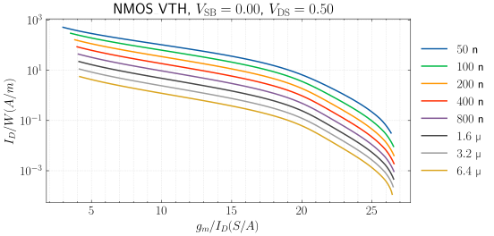
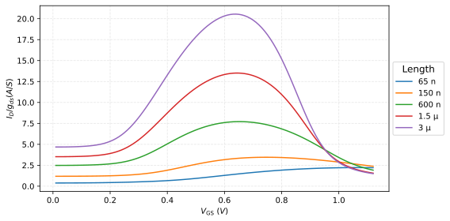
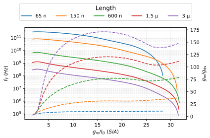
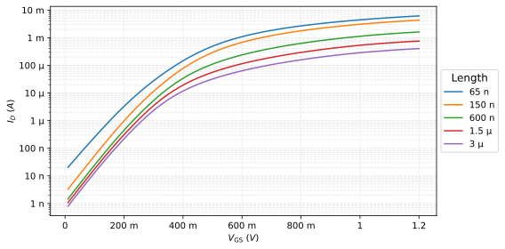
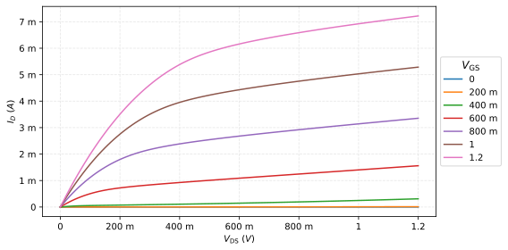
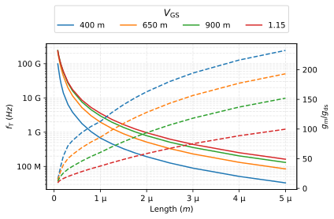
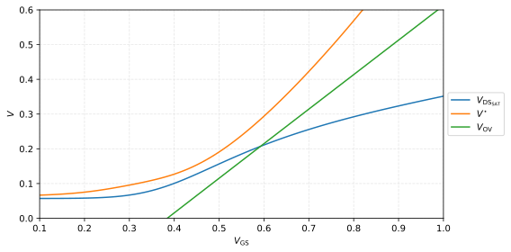

# Mosplot: MOSFET Characterization in Python

**Mosplot** is a Python tool for the gm/Id design
methodology. It drives a
SPICE or Spectre simulator to build lookup tables of MOSFET operating-point
parameters, then lets you plot, interpolate, and size analog circuits from
those tables.

## Table of Contents

1. [Installation](#installation)
2. [Generating a Lookup Table](#generating-a-lookup-table)
   - [Step 1; Configure a Simulator](#step-1--configure-a-simulator)
   - [Step 2; Define Transistor Sweeps](#step-2--define-transistor-sweeps)
   - [Step 3; Build the Table](#step-3--build-the-table)
3. [Using a Lookup Table](#using-a-lookup-table)
4. [Plotting](#plotting)
   - [Built-in Expressions](#built-in-expressions)
   - [plot_by_expression](#plot_by_expression)
   - [plot_by_sweep](#plot_by_sweep)
   - [quick_plot](#quick_plot)
5. [Interpolation & Raw Lookups](#interpolation--raw-lookups)
6. [Optimization](#optimization)
7. [Acknowledgments](#acknowledgments)

---

## Installation

**Requirements:** Python 3.9+, numpy, scipy, matplotlib, and at least one
supported simulator (ngspice, hspice, or Spectre).

```bash
git clone https://github.com/medwatt/gmid.git
cd gmid
pip install .
```

---

## Generating a Lookup Table

Building a lookup table takes three steps: configure a simulator, define the
sweep ranges, then run the builder.

### Step 1:  Configure a Simulator

Pick one of the three supported simulators. All share the same parameter set;
only the class name differs.

#### ngspice

```python
from mosplot.lookup_table_generator.simulators import NgspiceSimulator

sim = NgspiceSimulator(
    # Path to the simulator binary (or just "ngspice" if it is on PATH).
    simulator_path="ngspice",

    # Simulation temperature in °C.
    temperature=27,

    # At least one of include_paths or lib_mappings must be provided.
    include_paths=[
        "./NMOS_VTH.inc",
        "./PMOS_VTH.inc",
    ],
    # lib_mappings=[("/path/to/models.lib", "tt_pre")],

    # Parameters to extract. Defaults to all available if omitted.
    parameters_to_save=["id", "vth", "vdsat", "gm"],

    # Transistor instance name used in the netlist.
    mos_spice_symbols=("m1", "m1"),

    # Device width, or any other model-specific sizing parameter.
    device_parameters={"w": 10e-6},

    # For models compiled with OpenVAF (.osdi):
    # osdi_paths=["./path/to/model.osdi"],

    # Extra SPICE lines appended verbatim to the netlist:
    # raw_spice=["line 1", "line 2"],
)
```

#### hspice

```python
from mosplot.lookup_table_generator.simulators import HspiceSimulator

sim = HspiceSimulator(
    simulator_path="hspice",
    temperature=27,
    lib_mappings=[("/tools/pdk/models/hspice/design_wrapper.lib", "tt_pre")],
    parameters_to_save=["id", "vth", "vdsat", "gm"],

    # When the transistor is wrapped in a subcircuit, set the first entry
    # to the instance name and the second to the hierarchical node name.
    mos_spice_symbols=("x1", "x1.main"),

    device_parameters={"w": 10e-6},
)
```

#### Spectre

```python
from mosplot.lookup_table_generator.simulators import SpectreSimulator

sim = SpectreSimulator(
    simulator_path="spectre",
    temperature=27,
    lib_mappings=[("/tools/pdk/models/spectre/design.scs", "tt")],
    parameters_to_save=["id", "vth", "vdsat", "gm"],
    mos_spice_symbols=("M1", "M1"),
    device_parameters={"w": 10e-6},
)
```

### Step 2: Define Transistor Sweeps

```python
from mosplot.lookup_table_generator import TransistorSweep

nmos_sweep = TransistorSweep(
    mos_type="nmos",
    vgs=(0, 1.0, 0.01),    # (start, stop, step)
    vds=(0, 1.0, 0.01),
    vbs=(0, -1.0, -0.1),
    length=[45e-9, 100e-9],
)

pmos_sweep = TransistorSweep(
    mos_type="pmos",
    vgs=(0, -1.0, -0.01),
    vds=(0, -1.0, -0.01),
    vbs=(0, 1.0, 0.1),
    length=[200e-9, 500e-9],
)
```

### Step 3: Build the Table

```python
from mosplot.lookup_table_generator import LookupTableGenerator

gen = LookupTableGenerator(
    description="freepdk 45nm",
    simulator=sim,
    model_sweeps={
        "NMOS_VTH": nmos_sweep,
        "PMOS_VTH": pmos_sweep,
    },
    # Number of parallel worker processes.
    # For ngspice, keep this at 1; ngspice already parallelises internally
    # and adding outer parallelism tends to slow things down.
    n_process=1,
)

# Optional: run a quick DC operating-point simulation to verify the setup
# before committing to a full sweep.
# gen.op_simulation()

# Run the sweep and write the table to disk as a .npz file.
gen.build("./freepdk_45nm")
```

---

## Using a Lookup Table

```python
import numpy as np
from mosplot.plot import load_lookup_table, Mosfet, Expression
```

Load the table:

```python
lookup_table = load_lookup_table("path/to/lookup-table.npz")
```

> **Tip:** Work in a REPL or Jupyter notebook so you load the table once and
> reuse it across multiple queries without waiting for the file to reload.

The table is a plain Python dict:

```python
print(lookup_table.keys())
# dict_keys(['nch_lvt', 'pch_lvt', 'width', 'description', 'simulator', 'parameter_names'])
```

Create `Mosfet` instances by fixing the bias point. All later queries operate
on this filtered view:

```python
nmos = Mosfet(lookup_table=lookup_table, mos="nch_lvt", vbs=0.0, vds=0.6,  vgs=(0.01, 1.10))
pmos = Mosfet(lookup_table=lookup_table, mos="pch_lvt", vbs=0.0, vds=-0.6, vgs=(-1.2, -0.01))
```

`vds` and `vbs` must be scalar. `vgs` as a `(min, max)` tuple filters
to that range; omit it to use all values in the table. To see the available
lengths:

```python
print(nmos.length)
# array([6.50e-08, 8.00e-08, 1.00e-07, ...])
```

---

## Plotting

### Built-in Expressions

Pass any of these to `x_expression` / `y_expression` in a plot or lookup call:


| Expression | Description |
|---|---|
| `gmid_expression` | $g_m / I_D$ |
| `vgs_expression` | $V_{GS}$ |
| `vds_expression` | $V_{DS}$ |
| `vbs_expression` | $V_{BS}$ |
| `gain_expression` | Intrinsic gain $g_m / g_{ds}$ |
| `current_density_expression` | $I_D / W$ |
| `transist_frequency_expression` | Transit frequency $f_T$ |
| `early_voltage_expression` | Early voltage $V_A$ |


To define a custom expression:

```python
Expression(
    variables=["id", "gds"],
    function=lambda x, y: x / y,
    label="$I_D / g_{ds}$",
)
```

### plot_by_expression

Plots across the filtered `vgs` range, with one curve per selected length.

**$I_D/W$ vs $g_m/I_D$:**

```python
nmos.plot_by_expression(
    x_expression=nmos.gmid_expression,
    y_expression=nmos.current_density_expression,
    filtered_values=nmos.length[0:-1:4],   # every 4th length
    y_scale="log",
    save_fig="./figures/nmos_current_density.svg",
)
```



**Custom expression on the y-axis:**

```python
nmos.plot_by_expression(
    x_expression=nmos.vgs_expression,
    y_expression=Expression(
        variables=["id", "gds"],
        function=lambda x, y: x / y,
        label="$I_D / g_{ds}$ (A/S)",
    ),
    filtered_values=nmos.length[0:-1:4],
)
```



**Adding a second y-axis** with `y2_expression`:

```python
nmos.plot_by_expression(
    x_expression=nmos.gmid_expression,
    y_expression=nmos.transist_frequency_expression,
    y2_expression=nmos.gain_expression,
    filtered_values=nmos.length[0:-1:4],
    y_scale="log",
    save_fig="./figures/nmos_twin_plot.svg",
)
```



### plot_by_sweep

Uses the full lookup table rather than the filtered instance. Useful for I-V
curves and length sweeps.

**Input characteristic** ($I_D$ vs $V_{GS}$):

```python
nmos.plot_by_sweep(
    length=nmos.length[:-1:4],
    vbs=0, vds=0.6,
    vgs=(0.01, 1.2, 0.01),
    x_expression=nmos.vgs_expression,
    y_expression=nmos.id_expression,
    primary="vgs",
    y_scale="log",
)
```



**Output characteristic** ($I_D$ vs $V_{DS}$):

```python
nmos.plot_by_sweep(
    length=65e-9,
    vbs=0,
    vds=(0.0, 1.2, 0.01),
    vgs=(0.0, 1.2, 0.2),
    x_expression=nmos.vds_expression,
    y_expression=nmos.id_expression,
    primary="vds",
)
```



**Speed and gain vs length:**

```python
nmos.plot_by_sweep(
    length=nmos.length[1:],
    vbs=0, vds=1.2,
    vgs=(0.4, 1.2, 0.25),
    x_expression=nmos.length_expression,
    y_expression=nmos.transist_frequency_expression,
    y2_expression=nmos.gain_expression,
    primary="length",
    y_scale="log", y2_scale="linear",
)
```



### quick_plot

Overlay arbitrary data arrays into a single plot; useful when you want to
compare quantities that share an x-axis but don't come from a single sweep.

**Extract the data:**

```python
vdsat, vov, vstar = nmos.lookup_expression_from_table(
    length=100e-9, vbs=0, vds=0.6,
    vgs=(0.01, 1.2, 0.01),
    primary="vgs",
    expression=[
        nmos.vdsat_expression,
        Expression(variables=["vgs", "vth"], function=lambda x, y: x - y),
        Expression(variables=["gm",  "id"],  function=lambda x, y: 2 / (x / y)),
    ],
)
```

**Plot:**

```python
x_values = np.arange(0.01, 1.2 + 0.01, 0.01)

nmos.quick_plot(
    x=[x_values, x_values, x_values],
    y=[vdsat, vstar, vov],
    legend=["$V_{\\mathrm{DS}_{\\mathrm{SAT}}}$", "$V^{\\star}$", "$V_{\\mathrm{OV}}$"],
    x_limit=(0.1, 1),
    y_limit=(0, 0.6),
    x_label="$V_{\\mathrm{GS}}$",
    y_label="$V$",
    save_fig="./figures/nmos_quick_plot.svg",
)
```



---

## Interpolation & Raw Lookups

**Interpolate at a single point**; given a length and a gm/Id target, find the
corresponding gain:

```python
x = nmos.interpolate(
    x_expression=nmos.length_expression,
    x_value=100e-9,
    y_expression=nmos.gmid_expression,
    y_value=15,
    z_expression=nmos.gain_expression,
)
```

**Interpolate over a 2D sweep:**

```python
x = nmos.interpolate(
    x_expression=nmos.vdsat_expression,
    x_value=(0.08, 0.12, 0.01),
    y_expression=nmos.gds_expression,
    y_value=(1e-6, 4e-6, 1e-6),
    z_expression=nmos.gmid_expression,
)
```

**Direct table lookup (no interpolation):**

```python
x = nmos.lookup_expression_from_table(
    length=65e-9,
    vbs=0,
    vds=(0.0, 1.2, 0.01),   # primary sweep variable
    vgs=(0.0, 1.2, 0.2),    # secondary; omit to use all table values
    primary="vds",
    expression=nmos.current_density_expression,
)
```

---

## Optimization

Define the free parameters and target specifications, implement a `Circuit`
class that maps them to performance metrics, then run the optimizer:

```python
from mosplot.optimizer import Optimizer, DesignReport
from datatypes import Spec, OptimizationParameter

parameters = [
    OptimizationParameter("L_input",    (100e-9, 2e-6)),
    OptimizationParameter("gmid_input", (7, 16)),
    OptimizationParameter("L_load",     (100e-9, 2e-6)),
    OptimizationParameter("gmid_load",  (7, 15)),
    OptimizationParameter("L_tail",     (100e-9, 2e-6)),
    OptimizationParameter("gmid_tail",  (7, 15)),
    OptimizationParameter("Ibias",      (1e-6, 40e-6)),
]

target_specs = {
    "GBW":       Spec(5e6,    "max", 5),
    "Gain":      Spec(30,     "max", 2),
    "Ibias":     Spec(20e-6,  "min", 1),
    "ICMR_LOW":  Spec(0.1,    "min", 1),
    "ICMR_HIGH": Spec(0.7,    "max", 5),
    "CMRR":      Spec(2000,   "max", 3),
    "Area":      Spec(15e-12, "min", 1),
}

circuit = Circuit(lookup_table, pmos_range, nmos_range, "pch_lvt", "nch_lvt", VDD, CL)
optimizer = Optimizer(circuit, parameters, target_specs)
optimizer.optimize(maxiter=5)

report = DesignReport(circuit, optimizer)
print(report.report())
```

---

## Acknowledgments

- HSPICE output parsing is based on [this script](https://github.com/HMC-ACE/hspiceParser).

- If you find this tool useful, please cite it:

    ```bibtex
    @misc{medwatt_mosplot,
        author       = {Mohamed Watfa},
        title        = {{Mosplot: The MOSFET Characterization Tool}},
        month        = mar,
        year         = 2025,
        publisher    = {GitHub},
        journal      = {GitHub repository},
        howpublished = {\url{https://github.com/medwatt/gmid}},
        note         = {Accessed: 2025-03-31}
    }
    ```
