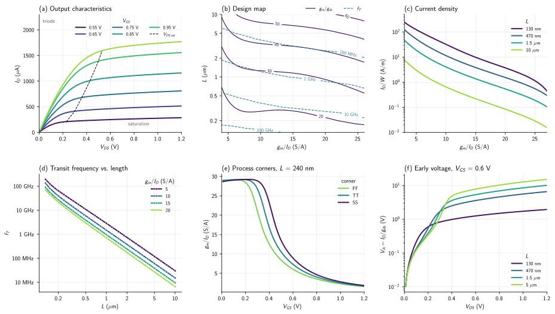

# Mosplot

Mosplot is a Python framework for analog circuit design using the gm/ID
methodology. It characterizes MOS transistors by simulation, builds design
charts from the resulting data, and sizes complete circuits automatically across
process corners.



The flow has three parts.

**Lookup table generation.** A DC sweep over length and terminal voltages is run
with **ngspice**, **HSPICE**, or **Spectre**. The operating-point parameters
(drain current, transconductances, output conductance, capacitances) are saved
to one table per technology and corner. See [lookup table
generation](docs/lookup_tables.md).

**Design charts.** Current density, transit frequency, intrinsic gain, or any
user expression can be plotted against gm/ID for each length, and exact values
at an operating point are obtained by interpolation on the table. See [design
charts](docs/plotting.md).

```python
nmos = Mosfet(lookup_table=lookup_table, mos="nmos", vbs=0.0, vds=0.6)
nmos.plot_by_expression(
    x_expression=nmos.gmid_expression,
    y_expression=nmos.transit_frequency_expression,
    y2_expression=nmos.gain_expression,
)
```

**Circuit optimization.** A circuit is described once as a system of equations
formulated with lookups into the table. The optimizer sizes it against the
targets at all corners simultaneously, reports the performance at each corner,
and writes a netlist for verification by simulation. Ready-made designs are
included for amplifiers, current mirrors, and reference circuits; using one in
a new technology needs only a configuration file with the tables, operating
conditions, and targets. See [circuit optimization](docs/optimization.md).

## Installation

Python 3.9 or later. Lookup table generation additionally requires one of the
supported simulators (ngspice, HSPICE, or Spectre).

```bash
pip install git+https://github.com/medwatt/gmid.git
```

For development, install from a local clone:

```bash
git clone https://github.com/medwatt/gmid.git
cd gmid
pip install -e .
```

## Citation

If this work is used in academic research, especially the optimization part, it
would be nice if you could cite it:

```bibtex
@article{watfa2026residual,
  author  = {Watfa, Mohamed and Garcia-Ortiz, Alberto and Sassatelli, Gilles},
  title   = {A Residual-Equation Framework for {$\mathrm{gm}/I_D$} Analog Circuit Design
             with Automated Multicorner Sizing},
  journal = {IEEE Transactions on Circuits and Systems I: Regular Papers},
  year    = {2026},
  doi     = {10.1109/TCSI.2026.3736902}
}
```

## Acknowledgments

The HSPICE output parser is based on
[hspiceParser](https://github.com/HMC-ACE/hspiceParser).
