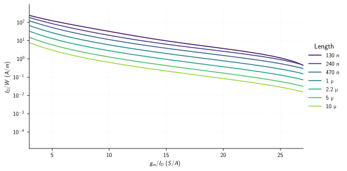
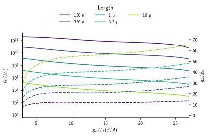
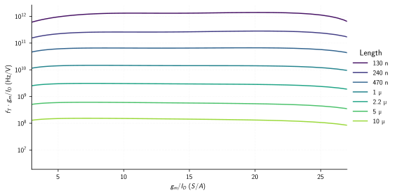
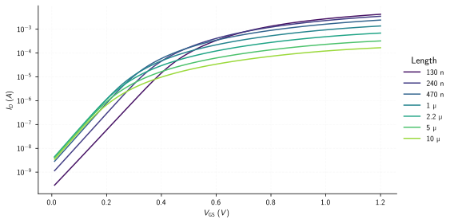
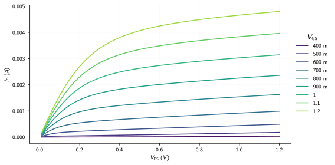
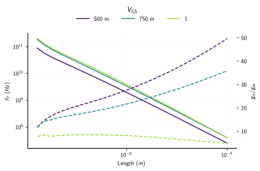
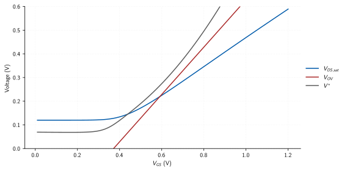

# Design Charts

This page describes how to plot quantities from a [lookup
table](lookup_tables.md) and how to read values from it by interpolation.

- [Loading a table and picking a device](#loading-a-table-and-picking-a-device)
- [Expressions: what to plot](#expressions-what-to-plot)
- [Design charts: `plot_by_expression`](#design-charts-plot_by_expression)
- [I-V curves and other sweeps: `plot_by_sweep`](#i-v-curves-and-other-sweeps-plot_by_sweep)
- [Your own data: `quick_plot`](#your-own-data-quick_plot)
- [Interpolation: `interpolate`](#interpolation-interpolate)
- [Plot options](#plot-options)

## Loading a table and picking a device

```python
import numpy as np
from mosplot.plot import load_lookup_table, Mosfet, Expression

lookup_table = load_lookup_table("path/to/table.npz")
```

> [!TIP]
> Work in a Jupyter notebook or REPL. You load the table once and every query
> after that is instant.

The table is 4-D (length × vbs × vgs × vds), but a plot is 2-D. A `Mosfet`
**fixes two of the four variables** and keeps the other two:

- The **primary** variable is swept along each curve.
- The **secondary** variable gives one curve per value.

```python
nmos = Mosfet(lookup_table=lookup_table, mos="nmos", vbs=0.0, vds=0.6, vgs=(0.01, 1.2))
pmos = Mosfet(lookup_table=lookup_table, mos="pmos", vbs=0.0, vds=-0.6, vgs=(-1.2, -0.01))
```

Here `vbs` and `vds` are fixed, `vgs` is swept (limited to the given
`(min, max)` range), and every length in the table becomes a curve. `mos` is the
model name used when the table was built. PMOS voltages keep their sign.

```python
print(nmos.length)   # the lengths available in the table
```

If two variables are left as ranges, say which one runs along the curve with
`primary="vgs"` (or `"vds"`, `"vbs"`, `"length"`).

## Expressions: what to plot

An **expression** is anything computed from the table. Every `Mosfet` comes with
these built in:


| Expression                                                                               | Quantity                              |
| ---                                                                                      | ---                                   |
| `gmid_expression`                                                                        | $\mathrm{gm}/I_D$                     |
| `current_density_expression`                                                             | $I_D/W$                               |
| `transit_frequency_expression`                                                           | $f_T = g_m / 2\pi C_{gg}$             |
| `gain_expression`                                                                        | intrinsic gain $g_m/g_{ds}$           |
| `early_voltage_expression`                                                               | $V_A = I_D/g_{ds}$                    |
| `inverse_early_voltage_expression`                                                       | $g_{ds}/I_D$                          |
| `rds_expression`                                                                         | $r_{ds} = 1/g_{ds}$                   |
| `vstar_expression`                                                                       | $V^\star = 2I_D/g_m$                  |
| `vov_expression`                                                                         | $V_{OV} = V_{GS} - V_{TH}$            |
| `vgs_expression`, `vds_expression`, `vbs_expression`, `length_expression`                | bias and geometry                     |
| `vsg_expression`, `vsd_expression`, `vsb_expression`                                     | sign-flipped versions, handy for PMOS |
| `id_expression`, `gm_expression`, `gds_expression`, `gmbs_expression`                    | raw small-signal values               |
| `vth_expression`, `vdsat_expression`                                                     | threshold and saturation voltage      |
| `cgg_expression`, `cgs_expression`, `cgd_expression`, `cdd_expression`, `cbg_expression` | capacitances                          |


**Custom expressions** take the table variables they need and a function that
combines them. For example, the figure of merit $f_T \cdot \mathrm{gm}/I_D$:

```python
fom = Expression(
    variables=["gm", "cgg", "id"],
    function=lambda gm, cgg, id: gm / (2 * np.pi * cgg) * gm / id,
    label=r"$f_T \cdot g_m/I_D$ (Hz/V)",
)
```

The names you can use are the saved parameters (`lookup_table["parameter_names"]`)
plus `length`, `vgs`, `vds`, and `vbs`.

## Design charts: `plot_by_expression`

Plots one expression against another over the device you defined, with one
curve per secondary value. Use `filtered_values` to pick which curves to show.

**Current density vs. $\mathrm{gm}/I_D$:**

```python
nmos.plot_by_expression(
    x_expression=nmos.gmid_expression,
    y_expression=nmos.current_density_expression,
    filtered_values=nmos.length[::4],   # every 4th length
    x_limit=(3, 27),
    y_scale="log",
)
```



**Two quantities on one chart.** Add `y2_expression` for a second y-axis
(dashed):

```python
nmos.plot_by_expression(
    x_expression=nmos.gmid_expression,
    y_expression=nmos.transit_frequency_expression,
    y2_expression=nmos.gain_expression,
    filtered_values=nmos.length[::6],
    x_limit=(3, 27),
    y_scale="log",
)
```



**A custom expression** works exactly the same way:

```python
nmos.plot_by_expression(
    x_expression=nmos.gmid_expression,
    y_expression=fom,
    filtered_values=nmos.length[::4],
    x_limit=(3, 27),
    y_scale="log",
)
```



## I-V curves and other sweeps: `plot_by_sweep`

`plot_by_expression` reuses the slice you chose when creating the `Mosfet`.
`plot_by_sweep` takes a **new slice**: give all four variables and name the
primary one. Use it for I-V curves or anything swept over length.

**Transfer characteristic** ($I_D$ vs. $V_{GS}$, one curve per length):

```python
nmos.plot_by_sweep(
    length=nmos.length[::4],
    vbs=0.0,
    vds=0.6,
    vgs=(0.01, 1.2),
    primary="vgs",
    x_expression=nmos.vgs_expression,
    y_expression=nmos.id_expression,
    y_scale="log",
)
```



**Output characteristic** ($I_D$ vs. $V_{DS}$, one curve per $V_{GS}$). A
`(start, stop, step)` tuple picks evenly spaced values:

```python
nmos.plot_by_sweep(
    length=nmos.length[0],
    vbs=0.0,
    vgs=(0.4, 1.2, 0.1),
    vds=(0.01, 1.2),
    primary="vds",
    x_expression=nmos.vds_expression,
    y_expression=nmos.id_expression,
)
```



**Speed and gain vs. length** (one curve per $V_{GS}$):

```python
nmos.plot_by_sweep(
    length=nmos.length,
    vbs=0.0,
    vds=0.6,
    vgs=(0.5, 1.0, 0.25),
    primary="length",
    x_expression=nmos.length_expression,
    y_expression=nmos.transit_frequency_expression,
    y2_expression=nmos.gain_expression,
    x_scale="log",
    y_scale="log",
)
```



## Your own data: `quick_plot`

To overlay quantities that don't come from a single plot call, first pull the
numbers out with `lookup_expression_from_table`, then pass them to
`quick_plot`. This call reads values straight from the table grid, with no
interpolation.

Below: three common definitions of the "saturation voltage", for one length:

```python
vgs, vdsat, vov, vstar = nmos.lookup_expression_from_table(
    length=nmos.length[4],
    vbs=0.0,
    vds=0.6,
    vgs=(0.01, 1.2, 0.01),
    primary="vgs",
    expression=[nmos.vgs_expression, nmos.vdsat_expression, nmos.vov_expression, nmos.vstar_expression],
)

nmos.quick_plot(
    x=[vgs, vgs, vgs],
    y=[vdsat, vov, vstar],
    legend=["$V_{DS,sat}$", "$V_{OV}$", "$V^{\\star}$"],
    x_label="$V_{GS}$ (V)",
    y_label="Voltage (V)",
    y_limit=(0, 0.6),
)
```



## Interpolation: `interpolate`

`interpolate` returns the value of any expression at a point given by two
other expressions, interpolating between table entries:

```python
id_w = nmos.interpolate(
    x_expression=nmos.length_expression,
    x_value=nmos.length[4],
    y_expression=nmos.gmid_expression,
    y_value=15,
    z_expression=nmos.current_density_expression,
)
```

A list of expressions returns several quantities at the same point:

```python
gain, ft = nmos.interpolate(
    x_expression=nmos.length_expression,
    x_value=nmos.length[4],
    y_expression=nmos.gmid_expression,
    y_value=15,
    z_expression=[nmos.gain_expression, nmos.transit_frequency_expression],
)
```

`x_value` and `y_value` also accept arrays, or `(start, stop, step)` tuples
that are expanded like `np.arange`. Two tuples evaluate every combination and
return the results as one flat array.

## Plot options

All three plot functions accept these keyword arguments:

| Option | Example | Effect |
|---|---|---|
| `x_limit`, `y_limit`, `y2_limit` | `(0, 25)` | Axis range. |
| `x_scale`, `y_scale`, `y2_scale` | `"log"` | Axis scale. |
| `x_eng_format`, `y_eng_format`, `y2_eng_format` | `True` | Tick labels like `10 µ` instead of `1e-05`. |
| `legend_placement` | `"right"`, `"top"`, `"bottom"`, `"best"` | Where the legend goes. |
| `legend_location` | `(1.0, 0.5)` | Exact legend anchor (overrides placement). |
| `show_legend` | `False` | Hide the legend. |
| `fig_size` | `(8, 4)` | Figure size in inches. |
| `save_fig` | `"chart.svg"` | Save to file (format from the extension). |
| `return_result` | `True` | Also return the plotted arrays.


