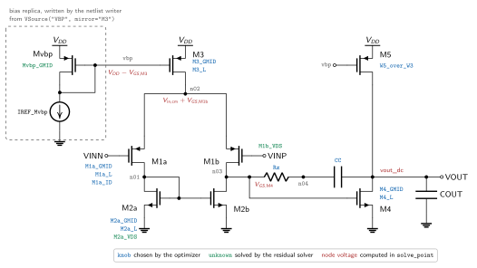

# Writing a Design from Scratch

This page builds a complete design file: a two-stage Miller OTA with a PMOS
input pair. The same procedure applies to any topology. The finished files are
in
[`examples/designs/VoltageAmplifiers/SingleEnded/Miller/pmos`](../examples/designs/VoltageAmplifiers/SingleEnded/Miller/pmos).
To optimize an [existing design](optimization.md), only a configuration file is
needed.

## How the optimizer works

Every quantity in a circuit model is one of three things: a **knob** chosen by
the optimizer (gm/ID, length, a branch current, a mirror ratio, CC, RZ), an
**unknown** solved by an inner nonlinear solver (a node voltage that depends on
itself through a lookup), or a **derived quantity** computed directly (widths,
currents, explicit node voltages). Widths are never knobs: for a device at a
given gm/ID, length, and VDS the table returns ID/W, and W = ID / (ID/W).

One evaluation of a candidate sizes the circuit at the reference corner (the
first in the list), freezes the geometry and conserved biases, re-solves the
operating point at every other corner with that geometry, and compares each
spec's worst value across corners with its target. The search is CMA-ES
followed by an SLSQP polish; designs whose DC operating point does not solve get
a large penalty graded by the solver residual.

A design has two files: `design.py` (topology, knobs, unknowns, equations,
specs, netlist hooks) is technology-independent and reused unchanged; the
configuration file (tables, conditions, knob bounds, targets) changes per
technology.

## Worked example: the Miller OTA



- First stage: PMOS input pair `M1a`/`M1b`, NMOS current-mirror load
  `M2a`/`M2b`, PMOS tail current source `M3`.
- Second stage: NMOS common-source `M4` with PMOS current-source load `M5`.
- Compensation: Miller capacitor `CC` with nulling resistor `Rz`.
- Bias: `M3` and `M5` share the node `vbp`, produced in the netlist by a
  diode-connected replica `Mvbp` fed by a reference current.

Blue names in the schematic are knobs, green are unknowns, red are node
voltages computed in `solve_point()`.

### Step 1: Topology

```python
from __future__ import annotations

import numpy as np

from mosplot.optimizer import (
    CircuitModel, Instance, Knob, Passive, Spec, State, Unknown, VSource,
    build_ss_model, run, vres, rres,
)


class Circuit(CircuitModel):
    NAME = "amp"                                    # subcircuit name in the netlist
    PORTS = ["VINN", "VINP", "VOUT", "vdd", "vss"]  # subcircuit port order
    GROUND = "vss"

    MOSFETS = [
        Instance("M1a", "pmos", d="n01",  g="VINN", s="n02", b="vdd"),
        Instance("M1b", "pmos", d="n03",  g="VINP", s="n02", b="vdd"),
        Instance("M2a", "nmos", d="n01",  g="n01",  s="vss", b="vss"),
        Instance("M2b", "nmos", d="n03",  g="n01",  s="vss", b="vss"),
        Instance("M3",  "pmos", d="n02",  g="vbp",  s="vdd", b="vdd"),
        Instance("M4",  "nmos", d="VOUT", g="n03",  s="vss", b="vss"),
        Instance("M5",  "pmos", d="VOUT", g="vbp",  s="vdd", b="vdd"),
    ]
    PASSIVES = [
        Passive("Rz",   "res", a="n04",  b="n03"),
        Passive("CC",   "cap", a="n04",  b="VOUT"),
        Passive("COUT", "cap", a="VOUT", b="vss", external=True),
    ]
    VSOURCES = [
        VSource("VDD", p="vdd", n="vss", supply=True),
        VSource("VBP", p="vbp", n="vss", mirror="M3"),
    ]
    SIGNAL_NODES = {"VINP", "VINN"}
```

`Instance(name, "nmos"/"pmos", d, g, s, b)` is one transistor and its four
terminals. `Passive(name, "res"/"cap", a, b)` is a resistor or capacitor;
`external=True` marks an element of the small-signal model that is not part of
the circuit, such as the load capacitance, whose value comes from the operating
conditions. `VSource(name, p, n, supply=True)` is the supply;
`VSource(name, p, n, mirror="M3")` is a bias node realized by a current mirror:
an AC ground in the small-signal model and, in the netlist, a diode-connected
copy of `M3` fed by a reference current (the replica `Mvbp` is not listed in
`MOSFETS`). `SIGNAL_NODES` are AC inputs; every other node on a voltage source is
an AC ground. Node names are free-form, except that the lower rail must use the
name in `GROUND`.

### Step 2: Knobs

Knobs are declared by name and role only; their numeric bounds live in the
configuration file, keeping `design.py` free of technology numbers.

```python
    KNOBS = [
        Knob("M1a_GMID", role="op", sets_width_of="M1a"),
        Knob("M2a_GMID", role="op", sets_width_of="M2a"),
        Knob("M3_GMID",  role="op", sets_width_of="M3"),
        Knob("M4_GMID",  role="op", sets_width_of="M4"),
        Knob("M1a_L", role="geom"),
        Knob("M2a_L", role="geom"),
        Knob("M3_L",  role="geom"),
        Knob("M4_L",  role="geom"),
        Knob("W5_over_W3", role="geom"),
        Knob("CC", role="geom"),
        Knob("Rz", role="geom"),
        Knob("M1a_ID", role="external"),
    ]
```

The role determines what happens at corners other than the reference:

| Role | Use for | Reference corner | Other corners |
|---|---|---|---|
| `"op"` | gm/ID of a device | chosen by the optimizer | re-solved so the device in `sets_width_of` equals its frozen width |
| `"geom"` | lengths, width ratios, multipliers, passive values | chosen by the optimizer | held fixed |
| `"external"` | externally applied bias: a reference current or bias voltage | chosen by the optimizer | held fixed, unless listed in `RECORNER_RESOLVE` |

Matched devices share knobs (`M1a`/`M1b` use `M1a_GMID` and `M1a_L`; likewise
`M2a`/`M2b`), and mirrors share gm/ID and length with their master (`M5` uses
`M3_GMID` and `M3_L`, sized by `W5_over_W3`). Use one current knob per
independent branch. Knob names are arbitrary; they are read back as attributes
(`v.M1a_GMID`) and must match the configuration file.

### Step 3: Derive the node voltages

Done on paper. Every transistor needs a VDS (and VSB) for its lookup; the
lookups take and return magnitudes, so every voltage in the model is positive
(PMOS signs are applied inside the lookup). Start from the known nodes:

| Node | Voltage | Reason |
|---|---|---|
| `VOUT` | Vout,dc | the intended output operating point, a condition |
| `n03` | VGS,M4 | gate of `M4`, source at ground |
| `n02` | Vin,cm + VGS,M1b | source of the input pair |
| `n01` | VGS,M2 | gate of the mirror |
| `vbp` | VDD − VGS,M3 | gate of the tail source |

Then check each VDS for whether it can be computed before its own device is
looked up:

| Device | VDS | Computable in advance? |
|---|---|---|
| `M4` | Vout,dc | yes: a condition |
| `M5` | VDD − Vout,dc | yes: a condition |
| `M2b` | VGS,M4 | yes, once `M4` is looked up |
| `M2a` | VGS,M2a (diode) | no: needs its own VGS → unknown `M2a_VDS` |
| `M1b` | Vin,cm + VGS,M1b − VGS,M4 | no: needs its own VGS → unknown `M1b_VDS` |
| `M1a` | Vin,cm + VGS,M1b − VGS,M2b | yes, once `M1b` and `M2b` are known |
| `M3` | VDD − Vin,cm − VGS,M1b | yes, once `M1b` is known |

A self-referential equation such as VDS,M2a = VGS,M2a(VDS,M2a) cannot be
evaluated in one pass, so it becomes an unknown. Everything else is evaluated
directly, in this order; the analysis fixes both the unknowns and the lookup
order.

### Step 4: Unknowns

```python
    UNKNOWNS = [
        Unknown("M1b_VDS",   seed=lambda c: c["vdd"] / 3, bound=lambda c: (0.02, c["vdd"])),
        Unknown("M2a_VDS",   seed=lambda c: c["vdd"] / 3, bound=lambda c: (0.02, c["vdd"])),
        Unknown("Mvbp_GMID", seed=lambda c: 12.0,         bound=lambda c: (4.0, 30.0)),
    ]
```

Each unknown has a `seed` (initial guess) and a `bound`, either constants or
functions of the conditions `c`; writing them in terms of `c["vdd"]` keeps the
design independent of the supply.

The third unknown belongs to the bias replica: `Mvbp` has the width and length
of `M3`, is diode-connected, and must produce the same gate voltage as `M3`.
Since its VDS equals its own VGS while `M3` runs at a different VDS, the two do
not sit at the same gm/ID; the solver finds the gm/ID at which the replica's VGS
matches `M3`, from which the reference current follows. Keep the number of
unknowns small: anything computable directly should not be one.

### Step 5: `solve_point()`

`solve_point()` does every lookup and derives every quantity; the inner solver
calls it many times per candidate with new trial unknowns.

```python
    def solve_point(self, v: State, dev, cond) -> State:
```

`v` holds the knobs and trial unknowns as attributes, `dev` is the active
corner's tables (`dev.nmos(...)`, `dev.pmos(...)`), and `cond` is its conditions
(`cond["vdd"]`, ...). Operating conditions, then lookups in dependency order:

```python
COUT = cond["cout"]
VDD = cond["vdd"]
VIN_CM = cond["vin_cm"]
VOUT_DC = cond["vout_dc"]

M4_VDS = VOUT_DC
M4 = dev.nmos(gmid=v.M4_GMID, L=v.M4_L, vds=M4_VDS, vsb=0.0)
M2a = dev.nmos(gmid=v.M2a_GMID, L=v.M2a_L, vds=v.M2a_VDS, vsb=0.0)   # unknown VDS
M2b_VDS = M4.vgs
M2b = dev.nmos(gmid=v.M2a_GMID, L=v.M2a_L, vds=M2b_VDS, vsb=0.0)
M1b = dev.pmos(gmid=v.M1a_GMID, L=v.M1a_L, vds=v.M1b_VDS, vsb=0.0)   # unknown VDS
M1a_VDS = VIN_CM + M1b.vgs - M2b.vgs
M1a = dev.pmos(gmid=v.M1a_GMID, L=v.M1a_L, vds=M1a_VDS, vsb=0.0)
M3_VDS = VDD - VIN_CM - M1b.vgs
M3 = dev.pmos(gmid=v.M3_GMID, L=v.M3_L, vds=M3_VDS, vsb=0.0)
M5_VDS = VDD - VOUT_DC
M5 = dev.pmos(gmid=v.M3_GMID, L=v.M3_L, vds=M5_VDS, vsb=0.0)
Mvbp = dev.pmos(gmid=v.Mvbp_GMID, L=v.M3_L, vds=M3.vgs, vsb=0.0)    # diode: VDS = VGS of M3
```

Each call returns a positive-magnitude `DevicePoint` with `vgs`, `vdsat`, `jd`
(ID/W), `gds_id` (gds/ID), `cgs`/`cgd`/`cdd`, and `vds_used`. `M2a` and `M2b`
share a gate voltage but are looked up separately because their drains differ.

Currents follow from KCL and mirror ratios, and widths from the current density;
matched devices copy their partner's width:

```python
ID = {
    "M1a": v.M1a_ID, "M1b": v.M1a_ID, "M2a": v.M1a_ID, "M2b": v.M1a_ID,
    "M3": 2 * v.M1a_ID,                          # M1a + M1b
    "M5": 2 * v.M1a_ID * v.W5_over_W3,
    "Mvbp": 2 * v.M1a_ID,
}
ID["M4"] = ID["M5"]
IREF_Mvbp = ID["M3"] * Mvbp.jd / M3.jd           # reference current for the vbp replica

W = {
    "M1a": ID["M1a"] / M1a.jd, "M1b": ID["M1a"] / M1a.jd,
    "M2a": ID["M2a"] / M2a.jd, "M2b": ID["M2a"] / M2a.jd,
    "M3":  ID["M3"] / M3.jd,   "M4":  ID["M4"] / M4.jd,
    "M5":  ID["M5"] / M5.jd,   "Mvbp": ID["M3"] / M3.jd,
}
```

`IREF_Mvbp` is the current of a diode with the width of `M3` at the gate voltage
of `M3`, i.e. the reference current the bias network must supply.

Small-signal parameters are needed for every device in `MOSFETS`; `small_signal`
scales the table capacitances from the table device width to the actual width
(`use_gmb=True` adds the body transconductance, which matters for cascodes; all
sources here are at their bulk, so it is off):

```python
ptw, ntw = dev.pmos.table_width, dev.nmos.table_width
ss = {
    "M1a": M1a.small_signal(v.M1a_GMID, ID["M1a"], W["M1a"], ptw, use_gmb=False),
    "M1b": M1b.small_signal(v.M1a_GMID, ID["M1b"], W["M1b"], ptw, use_gmb=False),
    "M2a": M2a.small_signal(v.M2a_GMID, ID["M2a"], W["M2a"], ntw, use_gmb=False),
    "M2b": M2b.small_signal(v.M2a_GMID, ID["M2b"], W["M2b"], ntw, use_gmb=False),
    "M3":  M3.small_signal(v.M3_GMID,  ID["M3"],  W["M3"],  ptw, use_gmb=False),
    "M4":  M4.small_signal(v.M4_GMID,  ID["M4"],  W["M4"],  ntw, use_gmb=False),
    "M5":  M5.small_signal(v.M3_GMID,  ID["M5"],  W["M5"],  ptw, use_gmb=False),
}
```

Return a `State` with the required `W`, `L` (per-device lengths, e.g.
`{"M1a": v.M1a_L, "M1b": v.M1a_L, ...}`), `ID`, `GMID` (per-device gm/ID), and
`ss`, plus every other quantity that `residuals()`, `specs()`, or the netlist
hooks read:

```python
return State(
    W=W, L=L, ID=ID, GMID=GMID, ss=ss,
    M1a=M1a, M1b=M1b, M2a=M2a, M2b=M2b, M3=M3, M4=M4, M5=M5, Mvbp=Mvbp,
    IREF_Mvbp=IREF_Mvbp,
    VDD=VDD, VIN_CM=VIN_CM, VOUT_DC=VOUT_DC, COUT=COUT, VBP=VDD - M3.vgs,
    CC=v.CC, Rz=v.Rz,
    M1b_VDS=v.M1b_VDS, M2a_VDS=v.M2a_VDS, Mvbp_GMID=v.Mvbp_GMID,
)
```

### Step 6: `residuals()`

One equation per unknown, written as "left side minus right side":

```python
def residuals(self, b) -> list:
    return [
        vres(b.M1b_VDS, b.VIN_CM + b.M1b.vgs - b.M4.vgs),   # V(n02) - V(n03)
        vres(b.M2a_VDS, b.M2a.vgs),                         # diode: VDS = VGS
        vres(b.Mvbp.vgs, b.M3.vgs),                         # replica matches M3
    ]
```

`b` is the `State` from `solve_point()`. `vres(lhs, rhs, scale=0.5)` returns
`(lhs - rhs)/0.5 V` for voltages; `rres(lhs, rhs, ref)` returns `(lhs - rhs)/|ref|`
for relative equalities such as currents. The number of residuals must equal the
number of unknowns; the optimizer checks this at start.

### Step 7: `specs()`

`specs()` turns the solved state into performance figures; it is a pure function
of `b`, with no lookups or solving.

```python
def specs(self, b, cond) -> dict:
    ss = build_ss_model(
        self.MOSFETS, self.PASSIVES, self.VSOURCES, b.ss,
        {"Rz": b.Rz, "CC": b.CC, "COUT": cond["cout"]},
        signal_nodes=self.SIGNAL_NODES,
    )
    ac = ss.transfer(inputs={"VINP": 0.5, "VINN": -0.5}, output={"VOUT": 1.0})   # differential
    ac_cm = ss.transfer(inputs={"VINP": 1.0, "VINN": 1.0}, output={"VOUT": 1.0})  # common mode
    out = {
        "GBW": ac.ugf(),
        "AC Gain (dB)": 20.0 * np.log10(max(abs(ac.gain()), 1e-300)),
        "PM": ac.phase_margin(),
        "DC CMR (dB)": 20.0 * np.log10(max(ac.rejection(ac_cm), 1e-300)),
    }
```

`build_ss_model()` assembles the small-signal circuit from the topology, the
device parameters, and the passives; `transfer()` applies an input stimulus and
observes a weighted sum of output nodes. Its methods are `gain()`, `ugf()`,
`phase_margin()`, `response(f)`, and `rejection(other)` (gain ratio, e.g. CMRR).
A differential output is observed with `output={"VOUTP": 1.0, "VOUTN": -1.0}`.

The output voltage Vout,dc is an input of the model (it sets the VDS of `M4` and
`M5`), but nothing yet forces the first stage to deliver the gate voltage `M4`
needs. In the real circuit `n03` sits at VGS,M2 while `M4` requires VGS,M4; the
difference is the systematic offset, which makes the open-loop output saturate
at a rail if it is not small. Report it and weight it heavily:

```python
out["VOUT_Error"] = abs(b.M4.vgs - b.M2a.vgs)
```

Area, current, bias voltage, and signal ranges follow the same way; every
saturation condition VDS ≥ VDS,sat becomes a limit on an input or output
voltage:

```python
out["Area"] = sum(b.L[m] * b.W[m] for m in b.W)
out["Itotal"] = b.ID["M1a"] + b.ID["M1b"] + b.ID["M5"]     # current drawn from VDD
out["VBP"] = b.VDD - b.M3.vgs
out["VOUT_MAX"] = b.VDD - b.M5.vdsat
out["VOUT_MIN"] = b.M4.vdsat
out["VIN_MAX"] = b.VDD - b.M3.vdsat - b.M1b.vgs
out["VIN_MIN"] = max(
    b.M1a.vdsat - b.M1b.vgs + b.M2b.vgs,
    b.M1b.vdsat - b.M1b.vgs + b.M4.vgs,
)
out["Output_Swing"] = out["VOUT_MAX"] - out["VOUT_MIN"]
return out
```

Every key appears in the report; only keys listed in `TARGET_SPECS` affect the
optimization.

### Step 8: Multicorner conservation

On silicon the bias is a fixed reference current into the diode `Mvbp`. When the
process changes, that current stays fixed while `vbp` and the `M3` tail current
move. To reproduce this at every non-reference corner:

```python
RECORNER_RESOLVE = ["M1a_ID"]

def freeze_extra(self, b) -> dict:
    return {"IREF_Mvbp": b.IREF_Mvbp}

def recorner_residuals(self, b, frozen) -> list:
    e = frozen["extra"]
    return [rres(b.IREF_Mvbp, e["IREF_Mvbp"], e["IREF_Mvbp"])]
```

`freeze_extra()` stores the reference current at the reference corner. At the
other corners `RECORNER_RESOLVE` releases `M1a_ID` (normally held fixed by its
`"external"` role), and `recorner_residuals()` pins it to the frozen value, so
the branch current drifts with the process as in the real mirror. The re-solve
must stay square: each entry in `recorner_residuals()` needs exactly one knob in
`RECORNER_RESOLVE`.

A bias applied as a fixed voltage (a `VSource` without `mirror`) whose value is
derived from a knob follows the same pattern: store the voltage in
`freeze_extra()`, add a `vres(...)` for it, and release the knob that determines
it. A circuit with no derived biases needs none of these hooks.

### Step 9: Netlist hooks

After optimization the frozen design is written as a Spectre subcircuit. The
hooks supply the values the topology alone does not contain:

```python
def mirror_currents(self, ref_op) -> dict:
    return {"VBP": ref_op.IREF_Mvbp}          # reference current of the vbp replica

def passive_values(self, ref_op) -> dict:
    return {"Rz": ref_op.Rz, "CC": ref_op.CC}  # optimized passives

def netlist_context(self, corner, ref_op=None) -> dict:
    return {"vcm": corner.cond("vin_cm"), "vout_dc": corner.cond("vout_dc")}
```

| Hook | Purpose |
|---|---|
| `passive_values()` | values of every non-external `Passive` |
| `mirror_currents()` | reference current of every `mirror=` bias; without it, the master device current is used |
| `vsource_values(ref_op, frozen)` | DC value of every bias written as an ideal voltage source |
| `isource_values(ref_op, frozen)` | DC value of every entry in `ISOURCES` |
| `netlist_context()` | values written as netlist `parameters`, for use by a testbench |
| `extra_netlist_lines()` | lines copied verbatim into the subcircuit |

### Step 10: The configuration file

Bind the design to a technology: tables, conditions, knob bounds, targets.

```python
from design import Circuit, run
from mosplot.optimizer import Corner, Knob, Spec

COND = dict(vdd=1.2, vin_cm=0.4, vout_dc=0.6, cout=5e-12)
LMIN, LMAX = 130e-9, 2e-6

PARAMETERS = [
    Knob("M1a_GMID", (10, 20)),
    Knob("M2a_GMID", (10, 20)),
    Knob("M3_GMID", (10, 20)),
    Knob("M4_GMID", (10, 20)),
    Knob("M1a_L", (LMIN, LMAX)),
    Knob("M2a_L", (LMIN, LMAX)),
    Knob("M3_L", (LMIN, LMAX)),
    Knob("M4_L", (LMIN, LMAX)),
    Knob("W5_over_W3", (1, 16)),
    Knob("CC", (1e-12, 2e-12)),
    Knob("Rz", (100, 10e3)),
    Knob("M1a_ID", (5e-6, 30e-6)),
]

TARGET_SPECS = {
    "GBW":          Spec(10e6,   "max", 1.0),
    "AC Gain (dB)": Spec(50.0,   "max", 1.0),
    "DC CMR (dB)":  Spec(50.0,   "max", 0.5),
    "PM":           Spec(70.0,   "max", 2.0),
    "Area":         Spec(50e-12, "min", 0.3),
    "Itotal":       Spec(50e-6,  "min", 1.0),
    "VOUT_Error":   Spec(0.02,   "min", 20.0),
}

CORNERS = [
    Corner("tt", "luts/tt.npz", "nmos", "pmos", conditions=COND),
    Corner("ff", "luts/ff.npz", "nmos", "pmos", conditions=COND),
    Corner("ss", "luts/ss.npz", "nmos", "pmos", conditions=COND),
]

if __name__ == "__main__":
    run(
        circuit=Circuit,
        parameters=PARAMETERS,
        target_specs=TARGET_SPECS,
        corners=CORNERS,
        output_module="./design.scs",
        maxiter=100,
        seed=1,
        workers=4,
    )
```

`COND` holds everything `solve_point()` reads from `cond`. A voltage or
temperature corner reuses a table with different conditions, e.g.
`Corner("tt_lowvdd", "luts/tt.npz", "nmos", "pmos", conditions=dict(COND, vdd=1.08))`.

Every knob of `design.py` needs a bound; `(lo, hi)` is a continuous range. Each
`Spec(target, mode, weight)` picks one of three penalty modes:

| Mode | Meaning | Penalty |
|---|---|---|
| `"max"` | larger is better, at least `target` | grows with log(target/value) below the target |
| `"min"` | smaller is better, at most `target` | grows with the relative excess above the target; a small term keeps pushing down even when met |
| `"eq"` | equal to `target` | squared relative deviation |

`weight` sets relative importance. A target of zero or below has no relative
scale and needs `Spec(..., scale=...)` in the unit of the spec. `run()` takes
`output_module` (required), `maxiter=300`, `n_restarts=1`, `seed=1`,
`ref_index=0`, `workers=1`, and `netlist_format="spectre"`; raise `n_restarts`
if results vary between seeds.

### Step 11: Run and read the results

Run `python config.py`. It prints the CMA-ES progress, the sized transistors
from the reference corner, then the performance at every corner:

```
Corner Results:
  Spec         | tt        | ff        | ss        | Target  | Binding
  -------------+-----------+-----------+-----------+---------+--------
  GBW          | 10.29M    | 10.47M    | 9.888M    | ≥10M    | ss
  AC Gain (dB) | 56.57     | 55.97     | 56.85     | ≥50     | ff
  PM           | 73.28     | 74.08     | 72.56     | ≥70     | ss
  VOUT_Error   | 6.235µ    | 318.8µ    | 383.8µ    | ≤20m    | ss
  Area         | 40.87 µm² | 40.87 µm² | 40.87 µm² | ≤50 µm² | tt
  Itotal       | 49.09µ    | 50.26µ    | 47.85µ    | ≤50µ    | ff
```

`Binding` names the corner with the worst value of each spec, which limits the
design. Area is identical at every corner because the geometry is frozen, while
Itotal and VBP vary because the bias current is conserved and the gate voltage
adjusts to it. The netlist for the reference corner is written to
`output_module`; the last two lines are the bias replica generated from
`VSource("VBP", mirror="M3")` and `mirror_currents()`:

```
parameters vcm=400m vout_dc=600m
subckt amp (VINN VINP VOUT vdd vss)
M1a (n01 VINN n02 vdd) pmos l=253.7n w=5.473u
M1b (n03 VINP n02 vdd) pmos l=253.7n w=5.473u
M2a (n01 n01 vss vss) nmos l=2u w=1.832u
M2b (n03 n01 vss vss) nmos l=2u w=1.832u
M3 (n02 vbp vdd vdd) pmos l=422.2n w=3.442u
M4 (VOUT n03 vss vss) nmos l=1.913u w=11.97u
M5 (VOUT vbp vdd vdd) pmos l=422.2n w=11.75u
Rz (n04 n03) resistor r=9.995k
CC (n04 VOUT) capacitor c=1.363p
Mvbp (vbp vbp vdd vdd) pmos l=422.2n w=3.442u
Ivbp (vbp vss) isource dc=11.29u
ends amp
```

Simulating this subcircuit at every corner is the final check of the model.

## Parallel evaluation

With `workers=4` each CMA-ES generation is evaluated by four processes;
`workers=1` (the default) runs serially. Processes share the lookup tables in
memory, and the SLSQP polish runs serially afterwards. Processes start with
`spawn` on every platform, so keep `run()` inside `if __name__ == "__main__":`
and define the circuit class in an importable module such as `design.py`, not a
notebook (use `workers=1` in a notebook).
